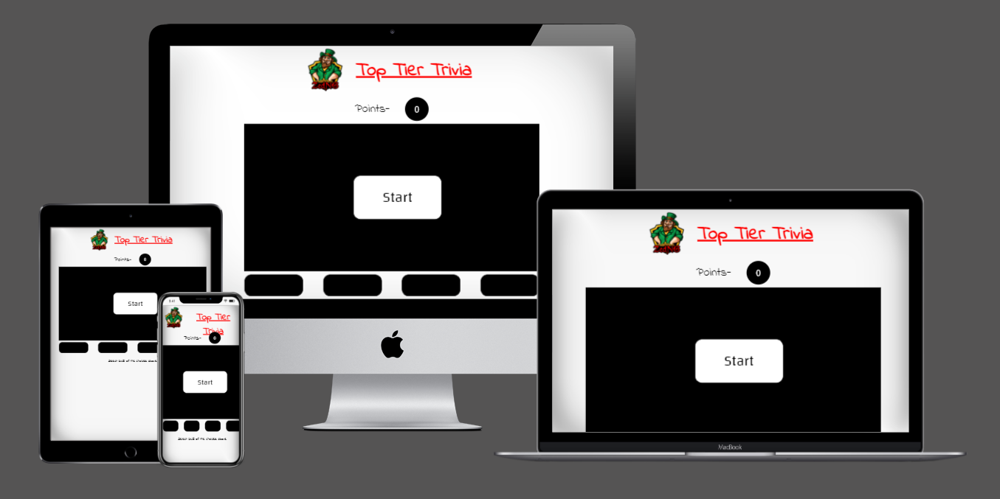
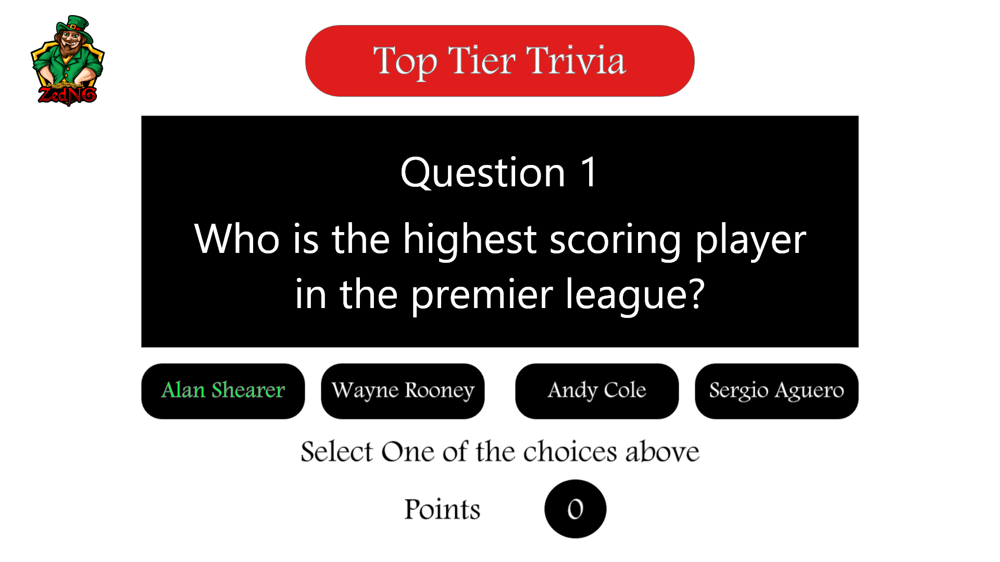
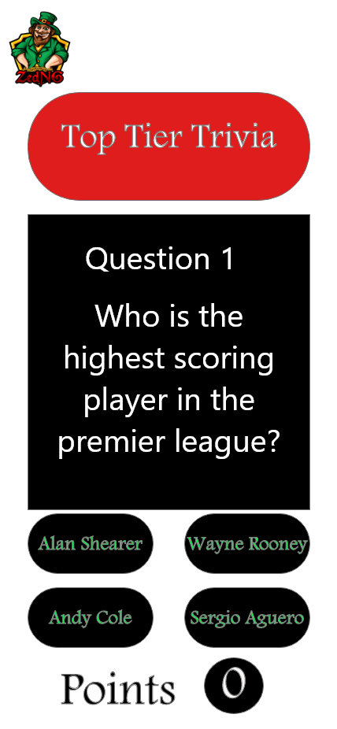
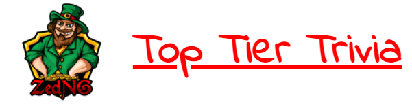
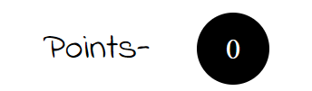
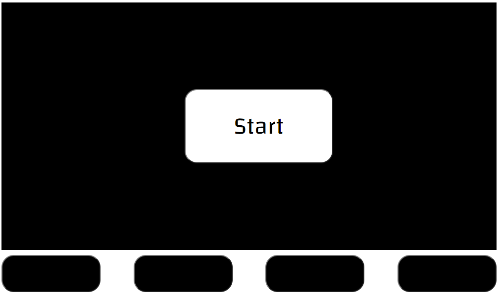
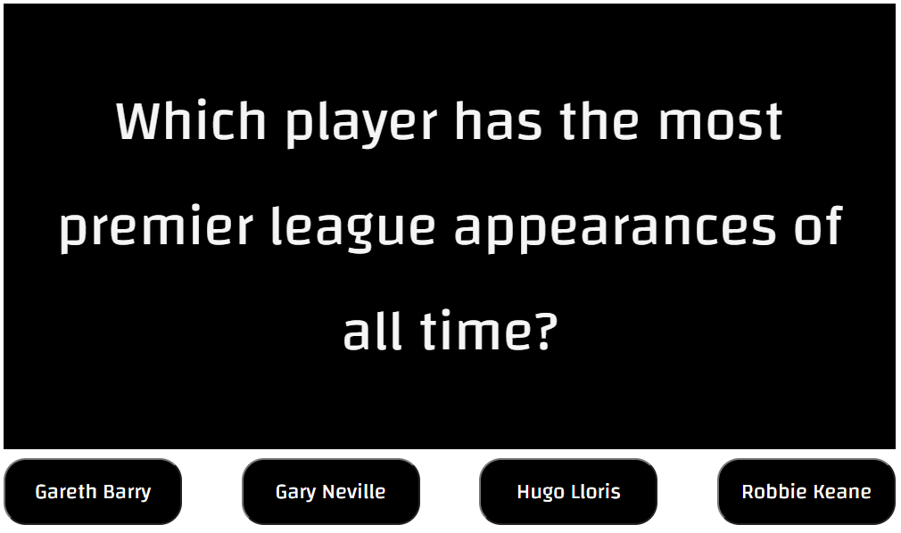
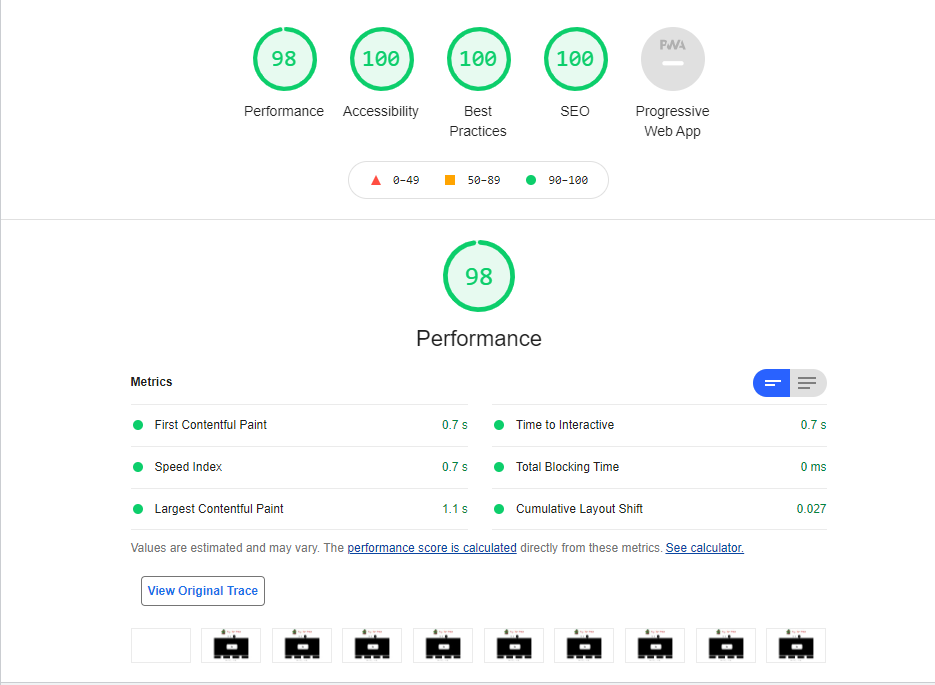

# Top Tier Trivia 

Top Tier Trivia is a simply designed quiz game that runs through a series of questions with increasing difficulty. For football fans, it is an opportunity to show what they know and see who can get the top score.

The quiz will give you 5 points for every correct answer and will be used by Fifa Twitch streamer, ZedNG, on his channel to test some of his followers knowledge of the game.

## [View live website in github pages](https://stephenkennygains.github.io/TopTierTrivia/)
---

## Table of contents

- [UX](#ux)
    - [Site goals](#site-goals)
    - [User goals](#user-goals)
    - [Wireframes](#wireframes)
- [Features](#features)
    - [Existing Features](#existing-features)
    - [Features Left To Imlement](#features-left-to-implement)
- [Testing](#testing)
    - [HTML](#HTML)
    - [CSS](#CSS)
    - [JavaScript](#JavaScript)
- [Code Validation](#validator-testing)
- [Unfixed Bugs](#unfixed-bugs)
- [Performance testing](#performance-testing)
- [Deployment](#deployment)
- [Credits](#credits)
- [Content](#content)
- [Media](#media)

## UX

## Site goals

The aim of the site is to create a space for football fans to test their knowledge of the game and to allow streamer ZedNG another opportunity to be abole to interact with his followers a more engaging way.

## User goals:
- The user should find the site easily by making sure SEO score is high
- The user will be able to easily see how to play the game and interact with it easily.
- the user should have an easy understanding of the games objective on first play.

## Wireframes

The wireframe for the project was done through Adode XD which made the project a lot easier to implement on the HTML and CSS front as it gives accurate sizes and layout. Although the end result deviated slighlty from the Wireframe, this was a personal choice of how I felt it looked through the various screen sizes.

## Features 

The quiz is designed with simplicity in mind. The layout is kept very minimal and with an aim at keeping the quiz very accessible for both desktop and mobile users. The structure follows a simple multiple choice structure with a question given and four possible answers, only one of which is correct.

### Existing Features

- __Top Tier Trivia Logo and Heading__

  - At the top of the page, the logo for streamer ZedNG is featured, alongside the name of the game and page so that users immediately see they have landed at the correct location.

- __The Score Area__

  - The score area is show directly below the header and logo to show the user that this is part of the game immediately. It was previously shown at the bottom of the page but being shown at the top, gives the user a clearer idea of the games intentions on first glance. The score will only increase on correct answers and will give 5 points. 
  - To give it some additional focus I gave it a short text prompt of points- in front of it and a rounded background to highlight it.

- __The Question and Answer section__

  - The question area contains a simple start button and blank background to begin with and four blank button options below that.
  - After pressing start, the start button will be hidden and the first question of the game will populate along with the first four possible answers to that question. 

### Features Left to Implement

- With More time, I would add an option to simply end game instead of restarting and have the score displayed as the users highest score so it could be screen shotted and shared
- To avoid users being able to simply google questions, with more time for the project, I would add a 10 second timer to each question before moving to the next question.
- As this will be used by the same user as my first Project, I will add a crossover between my first deployed website and this page or simply intergrate this into the first submitted project.

## Testing 

### __HTML__

- The Html of the page is very simplistic and was completed very quickly after developing the wireframe for the site. 
- The only complicated section of the HTML was upon implemeting some of the attributes to be linked to the JS file, particularly-
    - The question area containing the following line input type="hidden" id="currentQuestion" value="0"/ which allows the js file to identify the current positon of the questions and answers array. I got inspiration for this from the first Youtube video linked in the credits below.
    - And the id="answer-choice-0" onClick="checkAnswer(0)" on the answer buttons so that the answers in the array could be assigned to the individual buttons and have a function when selected. I orignally had an issue with this feature until I had added this to the HTML. I had assumed the JS would automatically assign to the buttons and played with the js file before realising there was nothing present to actually guide the answers to this section.

### __CSS__

- The CSS went through normal teething issues with responsive design. I made several adjustments to try avoid removing the logo from the header section on mobile.
- Flex box was used in most sections to give smoother transitions to screen sizes, particulalry in the answer Divs.
- One issue I encountered which was not resolved was that similarly to the start button, I originally had the answer buttons highlight when they were hovered over, however the JS function which highlights the buttons red or green for correct and incorrect answers would remove this feature but only on buttons which had been selected. Having looked through the function, having the buttons reset to their original state by looping back through the function of moveToNextQuestion instead of simply updating the color back to black, may solve the issue but due to time, this has not been tested yet.

### __JavaScript__

- The javascript gave me he most issues and a lot of additional study was needed and has been mentioned in the credits section below.
- The first step was implementing the start quiz function to have the start button remove from the screen and populate the first questions and answers from the questions array.
- The first issue encountered was that although I had written the moveToNextFunction as it currently stands (although I had previously written in bracket notation), I had not put in the html elements which allowed the function to actually populate on screen. I reviewed through this several times before realising that it could possibly be correct but had nothing allowing it be displayed. This is when the elements listed int he HTML section above were added which resolved the issue.
- The second issue was in changing the color of the buttons on selection. Originally I had tried using the technique of having a css class called 'hide' which changed the color of the answer divs but had display-none by default and was then removed in the JS. I got this idea from the first Youtube video linked in the credits below. I found that this seemed to be a more complex way of achieving the same outcome and instead reviewed back through the course content to the section of changing style elements directly in Javascript and found this easier to both understand and implement. Only when seeing the highlight issue mentioned in the CSS section above did I realise that the CSS method of changing the colors may help in allowing the highlighting of the answer buttons but I beleive I will achieve this through editing the JS function.
- The third issue I ran into was that although you could very briefly see the color change to the buttons, the next question would populate immediately after. To get around this I needed to add the setTimeout delay. Again I reviewed through the course material for this to find more inforamtion. Although I knew what I wanted to do with this I still made a mistake with this because I named the function (delay), forgetting that setTimeout was necessary for the function to work and not a changeable name.
- The restart function was also missing and only when I completed through each question did I see the issue. I used information I had gotten from the website linked in the credits below to implement this function. The functions to do this that I had seen in other projects and videos, seemed more complicated and relied on a lot of additional code. This method of essentially just refreshing the page was the most basic way I could think of to get my desired outcome without adding unneccessay complication.
- Another issue which was not related to my code was that my editor was not showing the different colors normally associated (such as a funcction or variable turning blue or pink for example, they would just remain as white text) so on a few cases I had to copy my code from github to VS code which I had already installed on my desktop to have isues highlighted easier.
- Lastly, I had used bracket notation in a lot of the code which I later updated to dot notation after putting the code through JShint.

### Validator Testing 

- HTML
    - No errors were returned when passing through the official [W3C validator](https://validator.w3.org/nu/?doc=https%3A%2F%2Fstephenkennygains.github.io%2FTopTierTrivia%2F)
- CSS
    - No errors were found when passing through the official [(Jigsaw) validator](https://jigsaw.w3.org/css-validator/validator?uri=https%3A%2F%2Fstephenkennygains.github.io%2FTopTierTrivia%2F&profile=css3svg&usermedium=all&warning=1&vextwarning=&lang=en)
- JavaScript
    - No errors were found when passing through the official [Jshint validator](https://jshint.com/)
      - Warnings found and corrected were some missing ; and the use of bracket notation over dot notation.
      - The following metrics were returned: 
      - There are 5 functions in this file.
      - Function with the largest signature takes 1 arguments, while the median is 0.
      - Largest function has 10 statements in it, while the median is 6.
      - The most complex function has a cyclomatic complexity value of 2 while the median is 1.

## Unfixed Bugs

Although there are no current bugs, there are additional features I would like to add which have all been outlined in the information above. An additional issue outlined below is in explicit height and width of the site logo downgrading perfromance despite being given explicit height and width dimensions.

## Performance Testing

The page was tested for performance through lighthouse and the image below shows the results of testing

## Deployment 

- The site was deployed to GitHub pages. The steps to deploy are as follows: 
  - In the GitHub repository, navigate to the Settings tab 
  - From the source section drop-down menu, select the Master Branch
  - Once the master branch has been selected, the page will be automatically refreshed with a detailed ribbon display to indicate the successful deployment. 

  To run localy:
- Log in to GitHub and click on repository to download ([TopTierTrivia](https://github.com/StephenKennyGains/TopTierTrivia))
- select `Code` and click Download the ZIP file.
- after download you can extract the file and use it in your local environment 

Alternatively you can [Clone](https://docs.github.com/en/free-pro-team@latest/github/creating-cloning-and-archiving-repositories/cloning-a-repository)
or [Fork](https://docs.github.com/en/free-pro-team@latest/github/getting-started-with-github/fork-a-repo)
this repository ([TopTierTrivia](https://github.com/StephenKennyGains/TopTierTrivia)) into your github account.

The live link can be found here - https://stephenkennygains.github.io/TopTierTrivia/

## Credits 

 - [Web Dev Simplified](https://www.youtube.com/watch?v=riDzcEQbX6k). I got inspiration for some sections of this quiz from this youtube video but felt that some of the code was excessive for the outcome I wanted. Watching the video through though helped me realise my errors in the HTML elements not calling the JS file.
 - [Brian Design](https://www.youtube.com/watch?v=f4fB9Xg2JEY&t=2203s). This video again seemed to have more complication that I felt was necessary but gave me inspiration for additional features that I would like to implement in the future.
 - [Javascript.info](https://javascript.info/) I found this web page hugely helpful. It gave me a better understanding of some of the core elements of my code and also gave me the idea for the restart function in my code. 
 - I had reviewed through some Peer-review submission on slack buthad ran in to the same issue as the videos listed above in that they had some more complexity than I thought necessary. I wanted my code and page to be clean and concise and took more inspiration from the LoveMaths walkthrough than peer submissions.

### Content 

- The logo on the page is taken from games Streamer and friend, ZedNG. [ZedNG](https://www.twitch.tv/zedng)
- Questions and answers were also inspired by ZedNG from his knowledge of football trivia.

### Media

- No media has been used in the site and media in this file have been created myself.